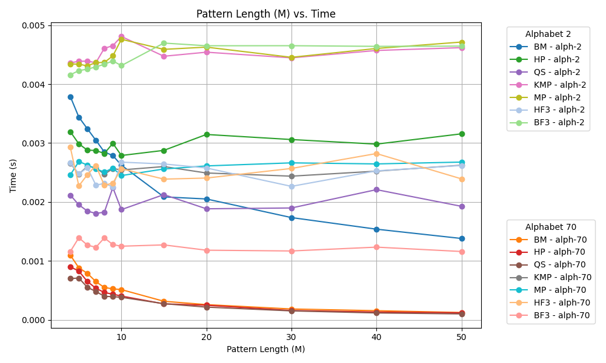

# Pattern Matching Algorithms
## Project Overview

The project analyzes the performance of pattern-matching algorithms on pseudo-randomly generated texts of 500,000 characters. Tests were conducted using alphabets of sizes 2 and 70, with pattern lengths varying from 4 to 50.

## Project Structure

The repository is organized as follows:

### Directories and Files

- **`Gen/`**: Contains the generated text, alphabets, and word lists for testing.
  - Subdirectories like `alph-x/` correspond to different alphabet sizes (e.g., `2`, `70`).
  - Files include `alphabet.txt`, `text.txt`, and `wordlist-m.txt` where `m` is the pattern length.

- **`Graph/`**: Contains a Python script (`main.py`) and a virtual environment for generating performance graphs.
  - Python 3.12.3 is used with `numpy` and `matplotlib`.

- **`generator.c`**: Generates text, alphabets, and word lists based on specified parameters.

- **`gen.sh`**: Shell script to automate the generation process.

- **`algos.c`**: Contains implementations of the pattern-matching algorithms.

- **`search.c`**: Executes the algorithms from `algos.c`.

## Algorithms Implemented

The following algorithms are implemented in `algos.c`:

- **Brute Force**:
  - `bruteFS1`: Without fast loop or sentinel.
  - `bruteFS2`: With fast loop, without sentinel.
  - `bruteFS3`: With fast loop and sentinel.
- **Helper Function Variants**:
  - `searchWithHelperFunc1`: Uses `strncmp`, without fast loop or sentinel.
  - `searchWithHelperFunc2`: Uses `strncmp`, with fast loop, without sentinel.
  - `searchWithHelperFunc3`: Uses `strncmp`, with fast loop and sentinel.
- **Classic Algorithms**:
  - Morris-Pratt (MP)
  - Knuth-Morris-Pratt (KMP)
  - Boyer-Moore (BM)
  - Horspool (HP)
  - Quick Search (QS)

## Running the Project

### Generating Data

Run the following commands to generate the required data:

1. Generate the alphabet:
```bash
  ./generator -m g -a 4
 ```
2. Generate the text:
```bash
  ./generator -m t -a 4 -l 500000 -i ./gen/alph-4/alphabet.txt > ./gen/alph-4/text.txt
```
3. Generate a wordlist that contains 100 words, 8 characters each with an alphabet of size 4:
```bash
  ./generator -m w -a 4 -l 8 -n 100 -i ./gen/alph-4/alphabet > wordlist-8.txt
```

The characters used in the alphabet are randomly generated from ASCII printable characters (character codes 32-127)

## Running the project
1. Compile and execute the search program:

```bash
  ./search -a algo -t text_file -w wordlist_file -m pattern_length
  cd Graph/
  python -m venv env
  . env/bin/activate
  pip install -r matplotlib numpy
  python main.py
```

## Benchmarks and Observations



##  Conclusion